# System Architecture Documentation

This document describes the system architecture of the Finance Tracker application, including component relationships, data flow, and technology stack.

## Overview

The Finance Tracker is a modern web application built with React and TypeScript, using Supabase as the backend service. The application follows a client-server architecture with real-time synchronization capabilities.

## Architecture Diagram

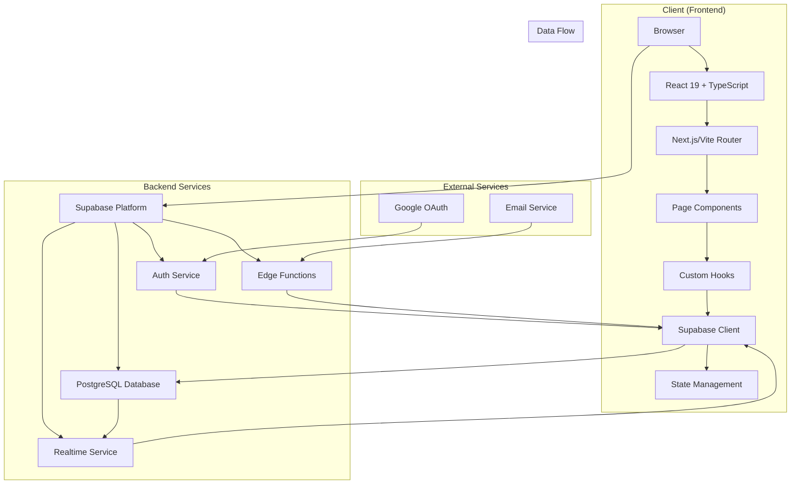

## Technology Stack

### Frontend
- **React 19**: Latest version with concurrent features
- **TypeScript 5.3**: Type-safe development
- **Tailwind CSS 3.4**: Utility-first CSS framework
- **Vite 5.1**: Fast build tool and development server
- **React Router v7**: Declarative routing
- **Chart.js 4.5**: Data visualization

### Backend
- **Supabase 1.128**: Backend-as-a-Service
- **PostgreSQL 15.4**: Database with RLS policies
- **Realtime Service**: WebSocket-based synchronization
- **Edge Functions**: Serverless functions
- **Auth Service**: JWT-based authentication

### Development Tools
- **ESLint**: Code linting
- **Prettier**: Code formatting
- **GitHub Actions**: CI/CD pipeline
- **GitHub Pages**: Deployment platform

## Component Architecture

### Page Components
The application uses a page-based architecture with the following components:

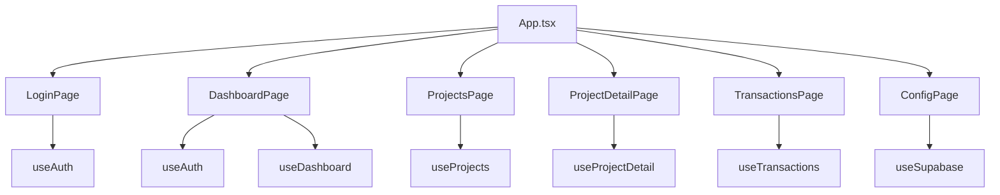

### Custom Hooks
Custom hooks manage state and logic:

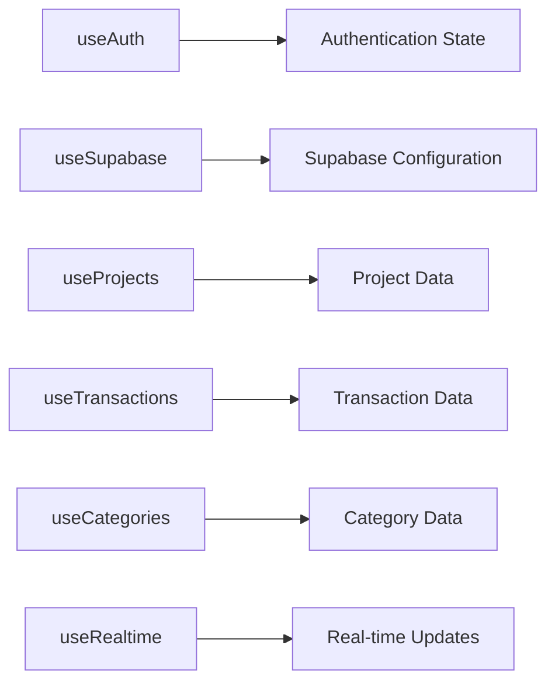

## Database Architecture

### Schema Overview
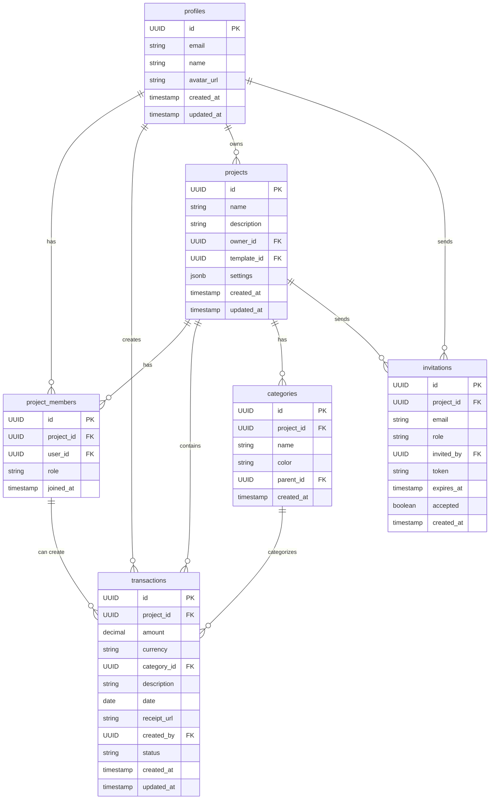

### Row-Level Security (RLS)
The database implements comprehensive RLS policies:

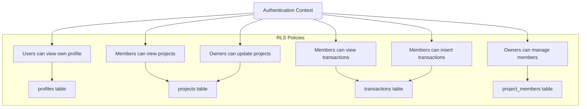

## Authentication Flow

### OAuth Authentication
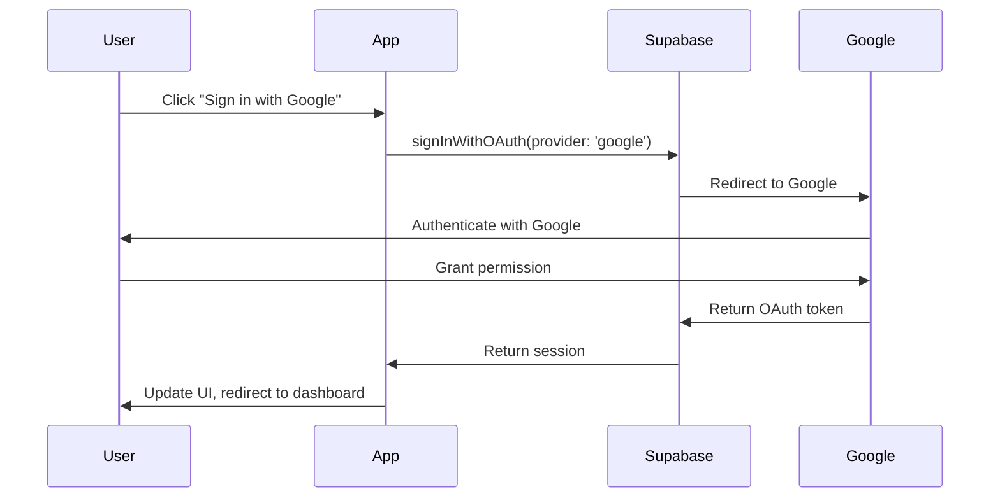

### Session Management
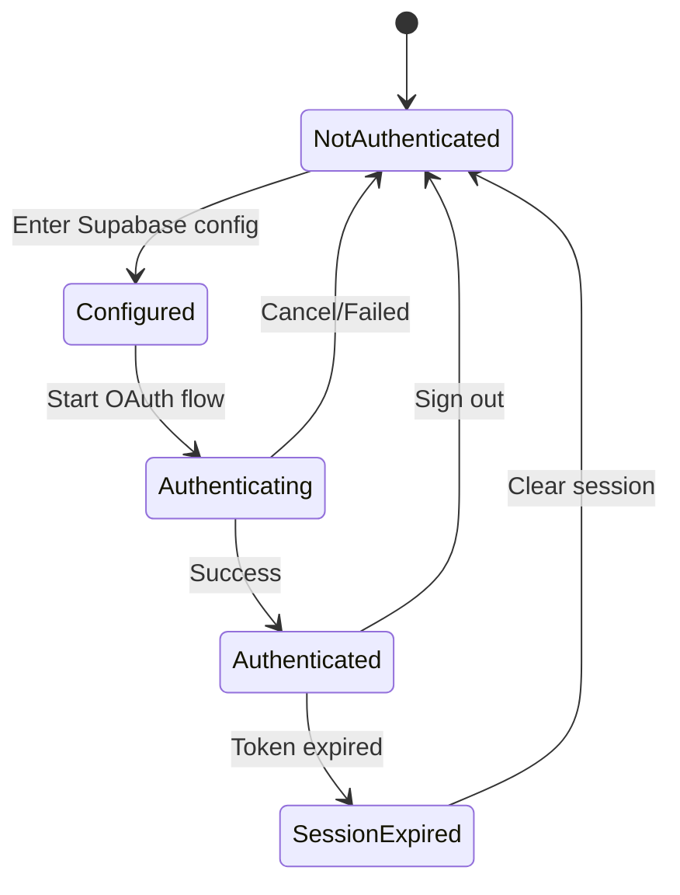

## Real-time Features

### Real-time Synchronization
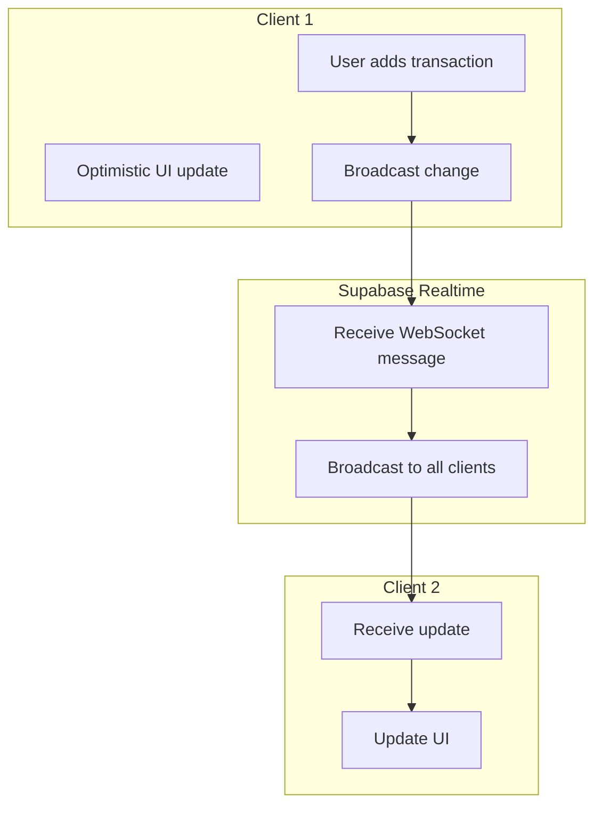

### Real-time Channels
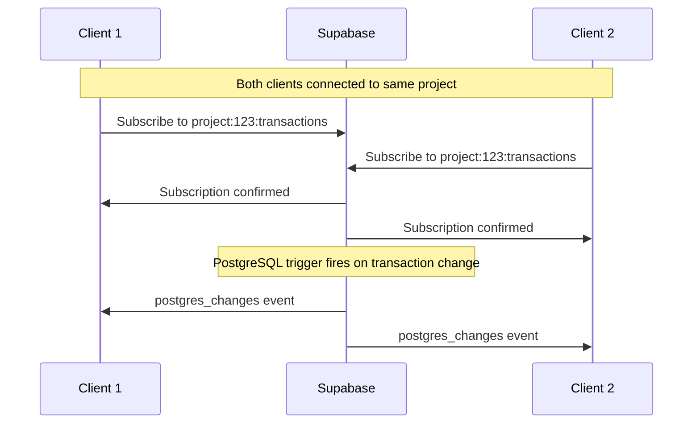

## Performance Architecture

### Caching Strategy
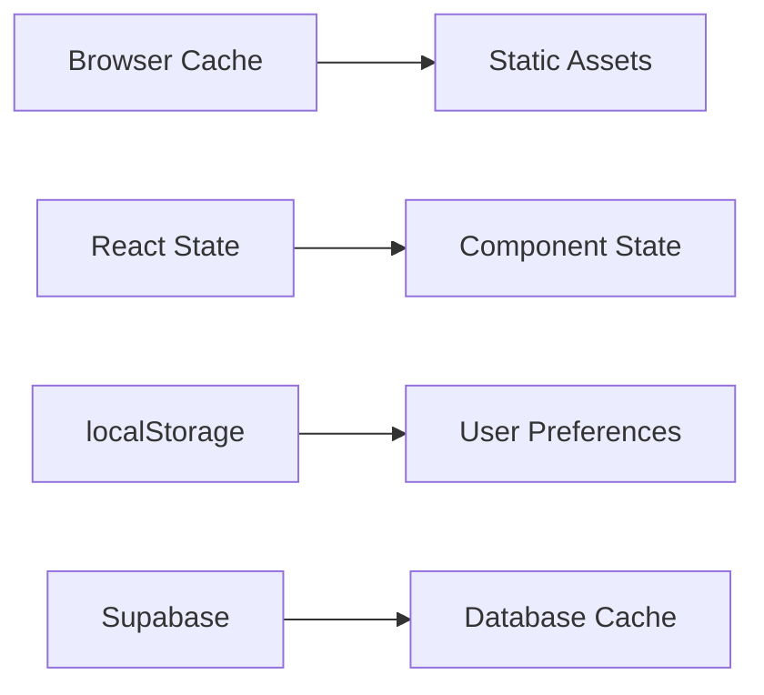

### Code Splitting
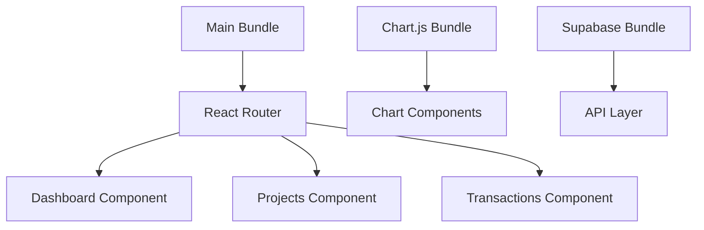

## Security Architecture

### Data Flow Security
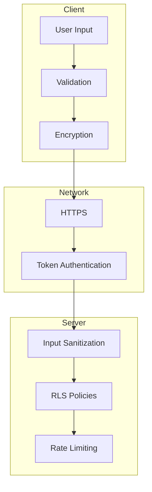

### Security Layers
1. **Client-side validation**: Input validation and sanitization
2. **Network security**: HTTPS, JWT tokens
3. **Database security**: RLS policies, encryption at rest
4. **Application security**: Rate limiting, CORS policies

## Deployment Architecture

### GitHub Pages Deployment
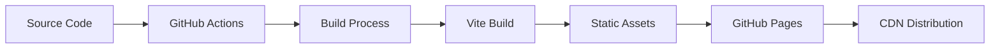

### Continuous Integration
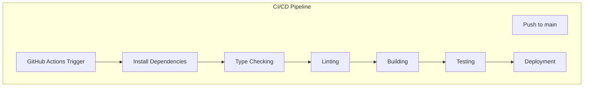

## Monitoring and Analytics

### Application Monitoring
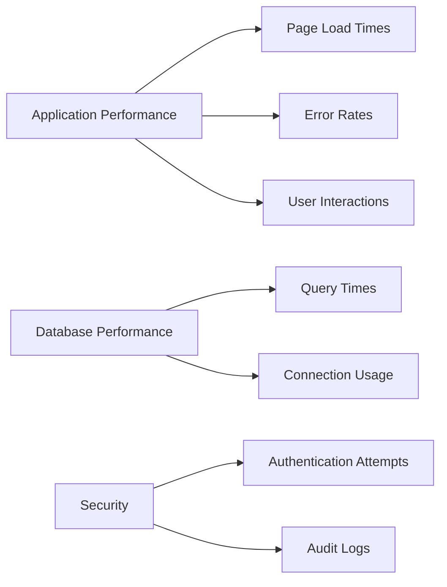

## Future Architecture Considerations

### Planned Enhancements
1. **Server Components**: Next.js server components for better performance
2. **Offline Support**: Service worker for offline functionality
3. **Advanced Analytics**: Real-time user behavior tracking
4. **Microservices**: Extract services to separate deployments
5. **Containerization**: Docker containers for consistent deployment

### Scalability Considerations
- **Database**: Read replicas for query scaling
- **Cache**: Redis for application-level caching
- **CDN**: Global content delivery network
- **Load Balancing**: Multiple deployment regions

---

*This architecture documentation provides a comprehensive overview of the Finance Tracker system. For specific implementation details, please refer to the [Developer Guide](developer-guide.md).*